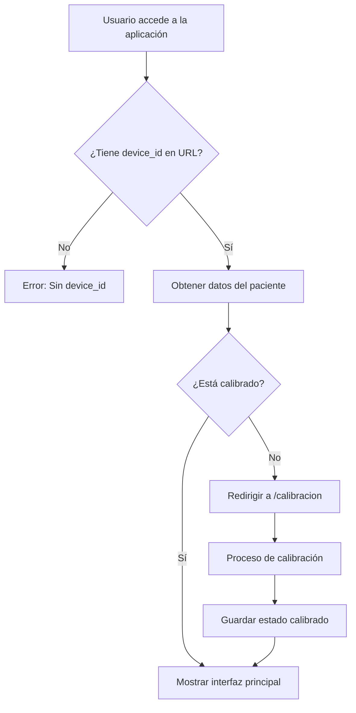
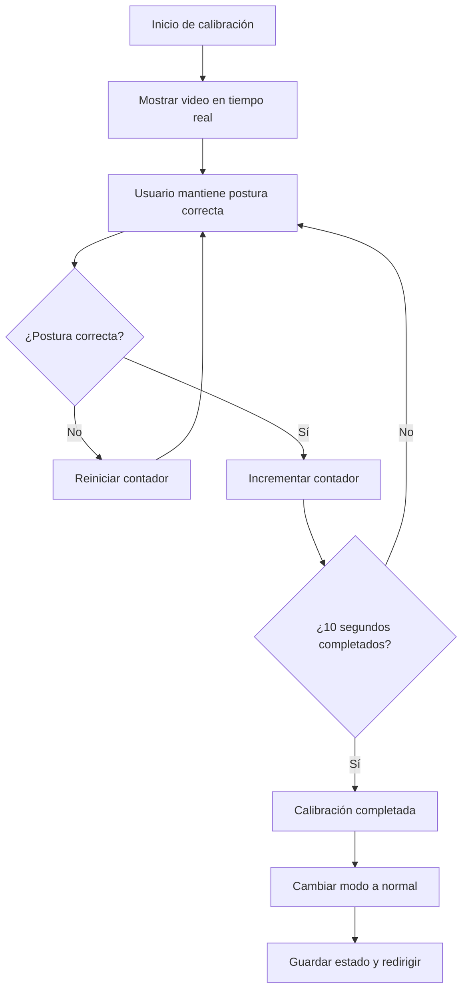
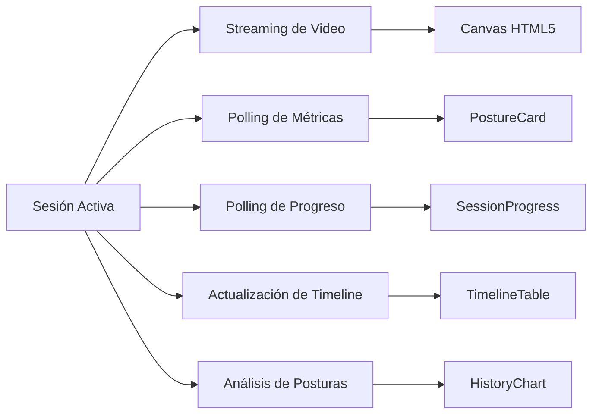

# Flujos de Usuario e Integración con el Backend

## Índice

1. [Flujos de Usuario Principales](#flujos-de-usuario-principales)
2. [Arquitectura de Comunicación Frontend-Backend](#arquitectura-de-comunicación-frontend-backend)
3. [Gestión de Estados y Sincronización](#gestión-de-estados-y-sincronización)
4. [Manejo de Errores y Casos Extremos](#manejo-de-errores-y-casos-extremos)
5. [Seguridad y Validación de Datos](#seguridad-y-validación-de-datos)

---

## 1. Flujos de Usuario Principales

### 1.1 Flujo de Inicio de Sesión



**Implementación del flujo**:

1. **Verificación de device_id**:
```typescript
// En App.tsx
useEffect(() => {
  const params = new URLSearchParams(window.location.search);
  const id = params.get("device_id");
  if (id) {
    setDeviceId(id);
  } else {
    console.error("No se encontró 'device_id' en la URL.");
  }
}, []);
```

2. **Obtención de datos del paciente**:
```typescript
useEffect(() => {
  if (!deviceId) return;
  
  (async () => {
    try {
      const res = await fetch(`http://${window.location.hostname}:8765/pacientes/${deviceId}`);
      if (!res.ok) {
        throw new Error(`Error al obtener paciente: ${res.statusText}`);
      }
      const data: Paciente = await res.json();
      setPaciente(data);
    } catch (err) {
      console.error(err);
    }
  })();
}, [deviceId]);
```

3. **Verificación de calibración**:
```typescript
// En AppRouter.tsx - Componente Decision
const force = params.get("forceCalib") === "1";
const calibrado = !force && localStorage.getItem("calibrado") === "1";

if (calibrado) {
  return <App />;
}
return <Navigate to={`/calibracion${location.search}`} replace />;
```

### 1.2 Flujo de Calibración

El proceso de calibración es crucial para el correcto funcionamiento del sistema:



**Código del contador de calibración**:

```typescript
// Polling del progreso
useEffect(() => {
  if (!calibrando || !sessionId) return;
  
  const interval = setInterval(async () => {
    try {
      const url = `http://${window.location.hostname}:8765/calib/progress/${sessionId}`;
      const { good_time, correcta } = await fetch(url).then(r => r.json());
      
      if (!correcta) {
        // Reiniciar si pierde la postura
        setEnMarco(false);
        setProgreso(0);
        return;
      }
      
      // Calcular progreso (0-100%)
      const pct = Math.min(100, (good_time / 10) * 100);
      setProgreso(pct);
      setEnMarco(pct > 0);
      
      if (pct >= 100) {
        setFinalizando(true);
        setCalibrando(false);
      }
    } catch {/* ignora errores */}
  }, 800);
  
  return () => clearInterval(interval);
}, [calibrando, sessionId]);
```

### 1.3 Flujo de Monitoreo de Sesión

Durante una sesión activa, múltiples procesos ocurren en paralelo:



**Implementación de procesos paralelos**:

```typescript
// 1. Streaming de video (WebSocket)
useEffect(() => {
  const ws = new WebSocket(`ws://${host}:8765/video/output?device_id=${deviceId}`);
  ws.binaryType = "arraybuffer";
  
  ws.onmessage = (event) => {
    const blob = new Blob([event.data], { type: "image/jpeg" });
    // Renderizar en canvas...
  };
  
  return () => ws.close();
}, [deviceId]);

// 2. Polling de métricas (cada 1s)
useEffect(() => {
  const interval = setInterval(() => {
    fetch(`http://${window.location.hostname}:8765/metricas/${sesionId}`)
      .then(res => res.json())
      .then(data => setPostura(data));
  }, 1000);
  
  return () => clearInterval(interval);
}, [sesionId]);

// 3. Polling de progreso (cada 1s)
useEffect(() => {
  const interval = setInterval(async () => {
    const res = await fetch(
      `http://${window.location.hostname}:8765/sesiones/progress/${session.id}`
    );
    const data = await res.json();
    setProgress(data);
    
    if (data.elapsed >= data.intervalo_segundos) {
      setSessionEnded(true);
    }
  }, 1000);
  
  return () => clearInterval(interval);
}, [session]);

// 4. Actualización de timeline (cada 3s)
useEffect(() => {
  const fetchTimeline = async () => {
    const res = await fetch(
      `http://${window.location.hostname}:8765/timeline/${session.id}`
    );
    const data = await res.json();
    setTimeline(data);
  };
  
  fetchTimeline();
  const interval = setInterval(fetchTimeline, 3000);
  
  return () => clearInterval(interval);
}, [session]);
```

### 1.4 Flujo de Finalización de Sesión

```mermaid
graph TD
    A[Tiempo transcurrido >= intervalo] --> B[Marcar sesión como finalizada]
    B --> C{¿Ya se notificó al backend?}
    C -- No --> D[POST /sesiones/end/{device_id}]
    C -- Sí --> E[Evitar duplicado]
    D --> F[Guardar marca en localStorage]
    F --> G[Limpiar estado de calibración]
    G --> H[Mostrar pantalla de fin]
    H --> I{¿Usuario reinicia?}
    I -- Sí --> J[POST /sesiones/reiniciar]
    J --> K[Redirigir a calibración]
    I -- No --> L[Fin]
```

---

## 2. Arquitectura de Comunicación Frontend-Backend

### 2.1 Protocolos de Comunicación

El sistema utiliza tres protocolos principales:

1. **HTTP REST API**: Para operaciones CRUD y consultas
2. **WebSocket**: Para streaming de video en tiempo real
3. **Server-Sent Events (potencial)**: Para notificaciones push

### 2.2 Endpoints y Contratos de API

#### Endpoints de Pacientes

```typescript
// GET /pacientes/{device_id}
interface PacienteResponse {
  id: number;
  telegram_id: string;
  device_id: string;
  nombre: string;
  edad: number;
  sexo: string | null;
  diagnostico: string | null;
}

// Ejemplo de uso
const obtenerPaciente = async (deviceId: string): Promise<Paciente> => {
  const response = await fetch(`${API_BASE}/pacientes/${deviceId}`);
  if (!response.ok) {
    throw new Error(`HTTP error! status: ${response.status}`);
  }
  return await response.json();
};
```

#### Endpoints de Sesiones

```typescript
// GET /sesiones/
interface SessionResponse {
  id: string;
  intervalo_segundos: number;
  modo: string;
  device_id: string;
  created_at: string;
}

// GET /sesiones/progress/{session_id}
interface ProgressResponse {
  intervalo_segundos: number;
  elapsed: number;
}

// POST /sesiones/end/{device_id}
interface EndSessionResponse {
  success: boolean;
  message: string;
  report_sent: boolean;
}

// POST /sesiones/reiniciar/{session_id}?device_id={device_id}
interface RestartSessionResponse {
  new_session_id: string;
  status: string;
}
```

#### Endpoints de Métricas y Análisis

```typescript
// GET /metricas/{session_id}
interface MetricasResponse {
  actual: string;
  transiciones_malas: number;
  porcentaje_correcta: number;
  porcentaje_incorrecta: number;
  tiempo_parado: number;
  tiempo_sentado: number;
  alertas_enviadas: number;
}

// GET /analysis/{session_id}
interface AnalysisResponse {
  [postura: string]: number; // Mapa de postura -> porcentaje
}

// GET /timeline/{session_id}
interface TimelineResponse {
  timestamp: string;
  postura: string;
  tiempo_mala_postura: number;
}[]

// GET /postura_counts/{session_id}
interface PosturaCountResponse {
  posture_label: string;
  count: number;
}[]
```

### 2.3 WebSocket para Streaming

#### Protocolo de Mensajes

```typescript
// Conexión WebSocket
const ws = new WebSocket(`ws://${host}:8765/video/output?device_id=${deviceId}`);

// Tipos de mensajes
type WebSocketMessage = 
  | ArrayBuffer  // Frame JPEG
  | string;      // Mensaje de control JSON

// Mensaje de control
interface ControlMessage {
  type: "modo" | "error" | "status";
  calibracion?: boolean;
  message?: string;
}

// Manejo de mensajes
ws.onmessage = (event) => {
  if (typeof event.data === "string") {
    // Mensaje de control
    const msg: ControlMessage = JSON.parse(event.data);
    handleControlMessage(msg);
  } else {
    // Frame de video
    handleVideoFrame(event.data as ArrayBuffer);
  }
};
```

### 2.4 Estrategias de Polling

El sistema implementa diferentes intervalos de polling según la criticidad:

```typescript
const POLLING_INTERVALS = {
  METRICS: 1000,      // 1 segundo - Alta frecuencia para tiempo real
  PROGRESS: 1000,     // 1 segundo - Crítico para fin de sesión
  TIMELINE: 3000,     // 3 segundos - Menos crítico
  CALIBRATION: 800,   // 800ms - Alta precisión durante calibración
};
```

---

## 3. Gestión de Estados y Sincronización

### 3.1 Estados Locales vs Remotos

```typescript
// Estados que se sincronizan con el backend
const estadosRemotos = {
  session: null,        // Desde GET /sesiones/
  progress: null,       // Desde GET /sesiones/progress/
  paciente: null,       // Desde GET /pacientes/
  postura: null,        // Desde GET /metricas/
  analysis: null,       // Desde GET /analysis/
  timeline: [],         // Desde GET /timeline/
};

// Estados puramente locales
const estadosLocales = {
  deviceId: null,       // Desde URL
  sessionEnded: false,  // Calculado localmente
  animar: false,        // Para animaciones UI
  enMarco: false,       // Estado visual calibración
  calibrado: false,     // Desde localStorage
};
```

### 3.2 Sincronización de Estados

#### Patrón de Sincronización Optimista

```typescript
const handlePostureUpdate = async (newPosture: PosturaData) => {
  // 1. Actualización optimista (UI responde inmediatamente)
  setPostura(newPosture);
  
  try {
    // 2. Sincronizar con backend
    const response = await fetch(`${API_BASE}/postura`, {
      method: 'POST',
      headers: { 'Content-Type': 'application/json' },
      body: JSON.stringify(newPosture)
    });
    
    if (!response.ok) {
      // 3. Revertir si falla
      setPostura(previousPosture);
      throw new Error('Failed to sync');
    }
  } catch (error) {
    // 4. Manejar error
    console.error('Sync failed:', error);
    showErrorToast('Error al sincronizar datos');
  }
};
```

#### Prevención de Condiciones de Carrera

```typescript
// Uso de refs para cancelar operaciones obsoletas
const useDataFetching = (url: string) => {
  const [data, setData] = useState(null);
  const [loading, setLoading] = useState(true);
  const abortControllerRef = useRef<AbortController>();
  
  useEffect(() => {
    // Cancelar petición anterior si existe
    abortControllerRef.current?.abort();
    
    // Crear nuevo controller
    const controller = new AbortController();
    abortControllerRef.current = controller;
    
    const fetchData = async () => {
      try {
        setLoading(true);
        const response = await fetch(url, {
          signal: controller.signal
        });
        
        if (!response.ok) throw new Error('Fetch failed');
        
        const result = await response.json();
        
        // Solo actualizar si no fue cancelado
        if (!controller.signal.aborted) {
          setData(result);
        }
      } catch (error) {
        if (error.name !== 'AbortError') {
          console.error('Fetch error:', error);
        }
      } finally {
        if (!controller.signal.aborted) {
          setLoading(false);
        }
      }
    };
    
    fetchData();
    
    // Cleanup
    return () => {
      controller.abort();
    };
  }, [url]);
  
  return { data, loading };
};
```

### 3.3 Cache y Optimización

```typescript
// Hook personalizado con cache
const useApiCache = () => {
  const cache = useRef(new Map());
  
  const fetchWithCache = async (key: string, fetcher: () => Promise<any>) => {
    // Verificar cache
    if (cache.current.has(key)) {
      const cached = cache.current.get(key);
      if (Date.now() - cached.timestamp < 60000) { // 1 minuto
        return cached.data;
      }
    }
    
    // Fetch nuevo
    const data = await fetcher();
    
    // Guardar en cache
    cache.current.set(key, {
      data,
      timestamp: Date.now()
    });
    
    return data;
  };
  
  return { fetchWithCache };
};
```

---

## 4. Manejo de Errores y Casos Extremos

### 4.1 Estrategias de Manejo de Errores

#### Errores de Red

```typescript
const fetchWithRetry = async (
  url: string, 
  options: RequestInit = {}, 
  maxRetries: number = 3
): Promise<Response> => {
  let lastError: Error;
  
  for (let i = 0; i < maxRetries; i++) {
    try {
      const response = await fetch(url, options);
      
      if (!response.ok && response.status >= 500) {
        // Error del servidor, reintentar
        throw new Error(`Server error: ${response.status}`);
      }
      
      return response;
    } catch (error) {
      lastError = error as Error;
      
      // Espera exponencial entre reintentos
      if (i < maxRetries - 1) {
        await new Promise(resolve => 
          setTimeout(resolve, Math.pow(2, i) * 1000)
        );
      }
    }
  }
  
  throw lastError!;
};
```

#### Errores de WebSocket

```typescript
class RobustWebSocket {
  private ws: WebSocket | null = null;
  private reconnectTimer: NodeJS.Timeout | null = null;
  private messageQueue: any[] = [];
  
  constructor(
    private url: string,
    private options: {
      maxReconnectDelay?: number;
      reconnectDelayGrowFactor?: number;
      minReconnectDelay?: number;
      onMessage?: (data: any) => void;
      onError?: (error: Event) => void;
      onStateChange?: (state: 'connecting' | 'open' | 'closing' | 'closed') => void;
    } = {}
  ) {
    this.connect();
  }
  
  private connect() {
    try {
      this.ws = new WebSocket(this.url);
      this.options.onStateChange?.('connecting');
      
      this.ws.onopen = () => {
        this.options.onStateChange?.('open');
        this.flushMessageQueue();
      };
      
      this.ws.onmessage = (event) => {
        this.options.onMessage?.(event.data);
      };
      
      this.ws.onerror = (error) => {
        this.options.onError?.(error);
      };
      
      this.ws.onclose = () => {
        this.options.onStateChange?.('closed');
        this.scheduleReconnect();
      };
    } catch (error) {
      this.scheduleReconnect();
    }
  }
  
  private scheduleReconnect() {
    if (this.reconnectTimer) return;
    
    const delay = this.calculateReconnectDelay();
    this.reconnectTimer = setTimeout(() => {
      this.reconnectTimer = null;
      this.connect();
    }, delay);
  }
  
  private calculateReconnectDelay(): number {
    // Implementar backoff exponencial
    return Math.min(
      this.options.maxReconnectDelay || 30000,
      (this.options.minReconnectDelay || 1000) * 
      Math.pow(this.options.reconnectDelayGrowFactor || 1.5, this.reconnectAttempts++)
    );
  }
  
  private flushMessageQueue() {
    while (this.messageQueue.length > 0) {
      const message = this.messageQueue.shift();
      this.send(message);
    }
  }
  
  public send(data: any) {
    if (this.ws?.readyState === WebSocket.OPEN) {
      this.ws.send(data);
    } else {
      // Encolar mensaje para enviar cuando se reconecte
      this.messageQueue.push(data);
    }
  }
  
  public close() {
    if (this.reconnectTimer) {
      clearTimeout(this.reconnectTimer);
      this.reconnectTimer = null;
    }
    this.ws?.close();
  }
  
  private reconnectAttempts = 0;
}
```

### 4.2 Casos Extremos Comunes

#### 1. Pérdida de Conexión Durante Calibración

```typescript
const handleCalibrationConnectionLoss = () => {
  // Guardar estado actual
  const calibrationState = {
    progress: progreso,
    timestamp: Date.now()
  };
  
  localStorage.setItem('calibration_recovery', JSON.stringify(calibrationState));
  
  // Mostrar mensaje al usuario
  showAlert({
    type: 'warning',
    title: 'Conexión perdida',
    message: 'Intentando reconectar. Tu progreso se ha guardado.',
    actions: [
      {
        label: 'Reintentar ahora',
        action: () => attemptReconnection()
      }
    ]
  });
};
```

#### 2. Datos Corruptos o Inválidos

```typescript
const validatePosturaData = (data: any): PosturaData | null => {
  try {
    // Validación de tipos
    if (typeof data !== 'object' || data === null) {
      throw new Error('Data is not an object');
    }
    
    // Validación de campos requeridos
    const requiredFields = [
      'actual', 'transiciones_malas', 'porcentaje_correcta',
      'porcentaje_incorrecta', 'tiempo_parado', 'tiempo_sentado',
      'alertas_enviadas'
    ];
    
    for (const field of requiredFields) {
      if (!(field in data)) {
        throw new Error(`Missing required field: ${field}`);
      }
    }
    
    // Validación de rangos
    if (data.porcentaje_correcta < 0 || data.porcentaje_correcta > 100) {
      throw new Error('Invalid percentage value');
    }
    
    if (data.porcentaje_incorrecta < 0 || data.porcentaje_incorrecta > 100) {
      throw new Error('Invalid percentage value');
    }
    
    // Validación de consistencia
    const totalPercentage = data.porcentaje_correcta + data.porcentaje_incorrecta;
    if (Math.abs(totalPercentage - 100) > 0.1) { // Tolerancia por redondeo
      throw new Error('Percentages do not sum to 100');
    }
    
    return data as PosturaData;
  } catch (error) {
    console.error('Invalid postura data:', error);
    return null;
  }
};
```

#### 3. Timeout en Operaciones Críticas

```typescript
const fetchWithTimeout = async (
  url: string, 
  timeout: number = 5000
): Promise<Response> => {
  const controller = new AbortController();
  
  const timeoutId = setTimeout(() => {
    controller.abort();
  }, timeout);
  
  try {
    const response = await fetch(url, {
      signal: controller.signal
    });
    
    clearTimeout(timeoutId);
    return response;
  } catch (error) {
    clearTimeout(timeoutId);
    
    if (error.name === 'AbortError') {
      throw new Error(`Request timeout after ${timeout}ms`);
    }
    
    throw error;
  }
};
```

---

## 5. Seguridad y Validación de Datos

### 5.1 Validación de Entrada

#### Sanitización de Parámetros URL

```typescript
const sanitizeDeviceId = (deviceId: string | null): string | null => {
  if (!deviceId) return null;
  
  // Eliminar caracteres no válidos
  const sanitized = deviceId.replace(/[^a-zA-Z0-9-_]/g, '');
  
  // Validar longitud
  if (sanitized.length < 3 || sanitized.length > 50) {
    console.error('Invalid device ID length');
    return null;
  }
  
  return sanitized;
};

// Uso
const deviceId = sanitizeDeviceId(params.get("device_id"));
if (!deviceId) {
  // Manejar error
  redirectToError("Device ID inválido");
}
```

#### Validación de Respuestas del Backend

```typescript
const validateApiResponse = <T>(
  data: unknown,
  schema: Schema<T>
): T => {
  const result = schema.safeParse(data);
  
  if (!result.success) {
    console.error('API response validation failed:', result.error);
    throw new Error('Invalid API response');
  }
  
  return result.data;
};

// Ejemplo con Zod
import { z } from 'zod';

const PacienteSchema = z.object({
  id: z.number(),
  telegram_id: z.string(),
  device_id: z.string(),
  nombre: z.string(),
  edad: z.number().min(0).max(150),
  sexo: z.string().nullable(),
  diagnostico: z.string().nullable()
});

// Uso
const pacienteData = await response.json();
const paciente = validateApiResponse(pacienteData, PacienteSchema);
```

### 5.2 Protección contra XSS

```typescript
const SafeText: React.FC<{ text: string }> = ({ text }) => {
  // Sanitizar texto antes de renderizar
  const sanitized = DOMPurify.sanitize(text, {
    ALLOWED_TAGS: [],
    ALLOWED_ATTR: []
  });
  
  return <span>{sanitized}</span>;
};

// Para contenido HTML controlado
const SafeHTML: React.FC<{ html: string }> = ({ html }) => {
  const sanitized = DOMPurify.sanitize(html, {
    ALLOWED_TAGS: ['b', 'i', 'em', 'strong', 'p', 'br'],
    ALLOWED_ATTR: []
  });
  
  return <div dangerouslySetInnerHTML={{ __html: sanitized }} />;
};
```

### 5.3 Manejo Seguro de Tokens y Credenciales

```typescript
class SecureStorage {
  private static encrypt(text: string): string {
    // Implementación básica - en producción usar Web Crypto API
    return btoa(text);
  }
  
  private static decrypt(text: string): string {
    return atob(text);
  }
  
  static setItem(key: string, value: any, options: {
    expires?: number; // minutos
    secure?: boolean;
  } = {}) {
    const data = {
      value,
      expires: options.expires 
        ? Date.now() + (options.expires * 60 * 1000) 
        : null
    };
    
    const serialized = JSON.stringify(data);
    const stored = options.secure 
      ? this.encrypt(serialized) 
      : serialized;
    
    localStorage.setItem(key, stored);
  }
  
  static getItem(key: string, secure: boolean = false): any {
    const stored = localStorage.getItem(key);
    if (!stored) return null;
    
    try {
      const serialized = secure 
        ? this.decrypt(stored) 
        : stored;
      
      const data = JSON.parse(serialized);
      
      // Verificar expiración
      if (data.expires && Date.now() > data.expires) {
        localStorage.removeItem(key);
        return null;
      }
      
      return data.value;
    } catch (error) {
      console.error('Error reading secure storage:', error);
      return null;
    }
  }
  
  static removeItem(key: string) {
    localStorage.removeItem(key);
  }
}
```

### 5.4 Rate Limiting del Cliente

```typescript
class RateLimiter {
  private requests: Map<string, number[]> = new Map();
  
  constructor(
    private maxRequests: number,
    private windowMs: number
  ) {}
  
  canMakeRequest(endpoint: string): boolean {
    const now = Date.now();
    const requests = this.requests.get(endpoint) || [];
    
    // Filtrar requests fuera de la ventana
    const recentRequests = requests.filter(
      timestamp => now - timestamp < this.windowMs
    );
    
    if (recentRequests.length >= this.maxRequests) {
      return false;
    }
    
    // Agregar nuevo request
    recentRequests.push(now);
    this.requests.set(endpoint, recentRequests);
    
    return true;
  }
  
  getRemainingTime(endpoint: string): number {
    const requests = this.requests.get(endpoint) || [];
    if (requests.length === 0) return 0;
    
    const oldestRequest = Math.min(...requests);
    const timeUntilReset = this.windowMs - (Date.now() - oldestRequest);
    
    return Math.max(0, timeUntilReset);
  }
}

// Uso
const rateLimiter = new RateLimiter(10, 60000); // 10 requests por minuto

const makeApiCall = async (endpoint: string) => {
  if (!rateLimiter.canMakeRequest(endpoint)) {
    const waitTime = rateLimiter.getRemainingTime(endpoint);
    throw new Error(`Rate limit exceeded. Try again in ${Math.ceil(waitTime / 1000)}s`);
  }
  
  return fetch(endpoint);
};
```

---

## Conclusión

La integración entre el frontend y el backend del sistema de detección de posturas demuestra una arquitectura robusta que maneja eficientemente:

1. **Comunicación en Tiempo Real**: A través de WebSockets para video y polling para métricas
2. **Gestión de Estados Complejos**: Con sincronización cuidadosa entre estados locales y remotos
3. **Manejo de Errores Robusto**: Con estrategias de recuperación y reintentos
4. **Seguridad**: Validación exhaustiva de datos y protección contra vulnerabilidades comunes

Las mejoras futuras podrían incluir:
- Implementación de GraphQL para consultas más eficientes
- Uso de Service Workers para funcionamiento offline
- Implementación de WebRTC para streaming de video con menor latencia
- Sistema de notificaciones push más sofisticado